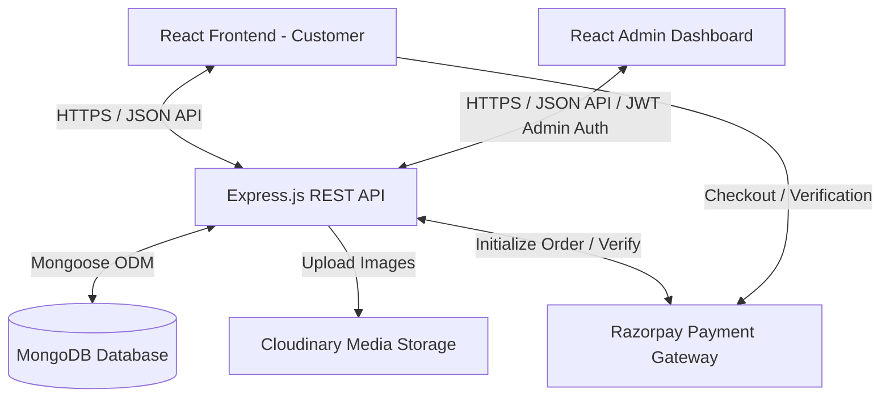

# Shopper — Full-Stack MERN E-Commerce Platform

Shopper is a production-ready, full-stack e-commerce platform designed with a modern user experience, a comprehensive admin workflow, and a robust API backend. The repository is structured as a monorepo consisting of:
1. **`front-end`**: A responsive, shopper-facing React web application with dynamic search, product filtering, interactive cart state, and Razorpay payment flow.
2. **`admin`**: An administrative dashboard for listing inventory, uploading product media, and managing customer order lifecycles.
3. **`backend`**: A secure Express.js REST API utilizing MongoDB (Mongoose ODM) for data persistence, JWT for authentication, and Cloudinary for asset storage.

---

## 🏗️ System Architecture



---

## ✨ Key Features

### 🛒 Customer Storefront (`front-end`)
* **Product Discovery**: Real-time product search, category filtering, subcategory sorting, and custom grid listings.
* **Interactive Shopping Cart**: Multi-size product selector, quantity adjustments, dynamic price calculations, and item availability tracking.
* **Seamless Checkout**: Multiple billing choices including **Cash on Delivery (COD)** and **Razorpay** checkout options.
* **Real-time Order History**: Custom portal displaying individual order placement date, address details, specific order items, payment method, and current status.
* **Responsive Styling**: Optimized layout for desktop, tablet, and mobile devices built using **Tailwind CSS v4** and modern CSS utility configurations.

### 🛡️ Admin Dashboard (`admin`)
* **Product Creator**: Form panel to add new products to the catalog, specifying metadata (name, description, price, categories, bestseller status, sizing checklist) and uploading up to 4 product showcase images.
* **Inventory Catalog**: List and view all live products, with instant deletion controls to remove inactive stock items.
* **Order Pipelines**: High-level tracking of all platform transactions, including detailed lists of customer-ordered products, total payment amounts, and shipping addresses.
* **Order Status Updates**: A select dropdown to update live shipping statuses (e.g., *Order Placed*, *Shipped*, *Out for delivery*, *Delivered*).
* **Restricted Access**: Administrative session lock screen authenticated via environment-managed JWT validation.

### ⚙️ Backend API Service (`backend`)
* **Robust Authentication**: Customer registration and sign-in pipelines secured with `bcrypt` password hashing and structured data validators.
* **Session Authorization**: Custom middleware layers verifying JSON Web Tokens (JWT) for secure cart alterations, order execution, and administrative panel requests.
* **Multipart Image Processing**: File upload pipeline utilizing `multer` disk storage configuration combined with the `cloudinary` Node.js SDK for cloud asset management.
* **Database Management**: Schema models built via Mongoose schemas enforce data formatting, relationships, and default values.

---

## 🛠️ Tech Stack & Dependencies

### Frontend & Admin Dashboards
* **Core**: React 19, JavaScript (ES6+), Vite (Build Tool)
* **Routing**: React Router DOM (v7)
* **Styling**: Tailwind CSS v4, Vanilla CSS
* **Networking & UI**: Axios, React Toastify (Notifications)

### Backend API Service
* **Runtime & Framework**: Node.js, Express.js (v5)
* **Database**: MongoDB, Mongoose ODM
* **Security & Auth**: JWT (JsonWebToken), Bcrypt, Validator
* **Media & Payments**: Cloudinary, Multer, Razorpay SDK, Stripe SDK

---

## 🔑 Environment Variables Configuration

To run the application locally, you will need to create and configure environmental configuration files.

### 1. Backend Service Configuration
Create a `.env` file in the `backend/` directory:
```env
PORT=4000
MONGODB_URI=your_mongodb_connection_string
JWT_SECRET=your_jwt_secret_key
ADMIN_EMAIL=admin@shopper.com
ADMIN_PASSWORD=your_secure_admin_password
CLOUDINARY_NAME=your_cloudinary_name
CLOUDINARY_API_KEY=your_cloudinary_api_key
CLOUDINARY_SECRET_KEY=your_cloudinary_secret_key
RAZORPAY_KEY_ID=your_razorpay_key_id
RAZORPAY_KEY_SECRET=your_razorpay_key_secret
```

### 2. Customer Frontend Configuration
Create a `.env` file in the `front-end/` directory:
```env
VITE_BACKEND_URL=http://localhost:4000
VITE_RAZORPAY_KEY_ID=your_razorpay_key_id
```

### 3. Admin Panel Configuration
Create a `.env` file in the `admin/` directory:
```env
VITE_BACKEND_URL=http://localhost:4000
```

---

## 🚀 Local Setup & Installation

Ensure you have [Node.js](https://nodejs.org/) installed on your machine.

### Step 1: Install Dependencies
Execute the following commands to install packages for each section:
```bash
# Install backend dependencies
cd backend && npm install

# Install customer frontend dependencies
cd ../front-end && npm install

# Install admin dashboard dependencies
cd ../admin && npm install
```

### Step 2: Start the Application Services

1. **Start the API Server**:
   ```bash
   cd backend
   npm run start
   ```
2. **Start the Customer Frontend**:
   ```bash
   cd front-end
   npm run dev
   ```
3. **Start the Admin Dashboard**:
   ```bash
   cd admin
   npm run dev
   ```

---

## 📡 API Endpoints Reference

### User Authentication (`/api/user`)
| Method | Endpoint | Description | Middleware / Headers |
| :--- | :--- | :--- | :--- |
| `POST` | `/api/user/register` | Register a new customer account | None |
| `POST` | `/api/user/login` | Authenticate customer credentials | None |
| `POST` | `/api/user/admin` | Authenticate administrator credentials | None |

### Product Catalog (`/api/product`)
| Method | Endpoint | Description | Middleware / Headers |
| :--- | :--- | :--- | :--- |
| `POST` | `/api/product/add` | Add a new product & upload up to 4 images | Admin Auth, Multer |
| `POST` | `/api/product/remove` | Delete a product by its Mongoose ID | Admin Auth |
| `GET` | `/api/product/list` | Fetch the complete catalog list | None |
| `POST` | `/api/product/single` | Retrieve details for a single product | None |

### Shopping Cart (`/api/cart`)
| Method | Endpoint | Description | Middleware / Headers |
| :--- | :--- | :--- | :--- |
| `POST` | `/api/cart/add` | Add an item (specific size) to the cart | Customer Auth (`token`) |
| `POST` | `/api/cart/update` | Modify item quantity in the cart | Customer Auth (`token`) |
| `POST` | `/api/cart/get` | Retrieve the customer's current cart | Customer Auth (`token`) |

### Orders & Checkout (`/api/order`)
| Method | Endpoint | Description | Middleware / Headers |
| :--- | :--- | :--- | :--- |
| `POST` | `/api/order/place` | Checkout and place order using Cash on Delivery | Customer Auth (`token`) |
| `POST` | `/api/order/razorpay` | Initialize a Razorpay payment order session | Customer Auth (`token`) |
| `POST` | `/api/order/verifyRazorpay` | Verify payment status from Razorpay signature | Customer Auth (`token`) |
| `POST` | `/api/order/userorders` | Fetch orders completed by the authenticated user | Customer Auth (`token`) |
| `POST` | `/api/order/list` | Fetch all system orders | Admin Auth |
| `POST` | `/api/order/status` | Update transaction delivery status | Admin Auth |

---

## 🗄️ Database Schemas

### User Schema (`userModel.js`)
```javascript
const userSchema = new mongoose.Schema({
    name: { type: String, required: true },
    email: { type: String, required: true, unique: true },
    password: { type: String, required: true },
    cartData: { type: Object, default: {} }
}, { minimize: false })
```

### Product Schema (`productModel.js`)
```javascript
const productSchema = new mongoose.Schema({
    name: { type: String, required: true },
    description: { type: String, required: true },
    price: { type: Number, required: true },
    image: { type: Array, required: true },
    category: { type: String, required: true },
    subCategory: { type: String, required: true },
    sizes: { type: Array, required: true },
    bestseller: { type: Boolean },
    date: { type: Number, required: true }
})
```

### Order Schema (`orderModel.js`)
```javascript
const orderSchema = new mongoose.Schema({
    userId: { type: String, required: true },
    items: { type: Array, required: true },
    amount: { type: Number, required: true },
    address: { type: Object, required: true },
    status: { type: String, required: true, default: 'Order Placed' },
    paymentMethod: { type: String, required: true },
    payment: { type: Boolean, required: true, default: false },
    date: { type: Number, required: true }
})
```
